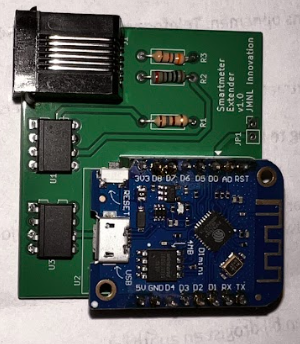

# Soldering the hardware version 1.0

The image below shows the components that are used to create the P1 Extender. Not many components. Using these components it is possible to simulate a smartmeter.

## Step 1 Solder the resistors

Make sure you check the resistor values and place them at the right spot!

## Step 2 Solder the 6N137 opto coupler chips

Pin one it marked on the print (square pin pad) and pin one is marked on the chip (a dot). Make sure you place it right!

## Step 3 Solder the WEMOS D1 mini

The WEMOS come with header pins. You can optionally place female headers, so it is possible to remove the WEMOS if required. I find that very usefull. In any case, you need to solder male header pins on the WEMOS. Using these header pins you are able to solder the WEMOS to the print. The figure below shows the female header on the print and the WEMOS male header.

## Step 4 Solder RJ11 connector

## Putting everything together

Place your WEMOS and it should look like the images below.

